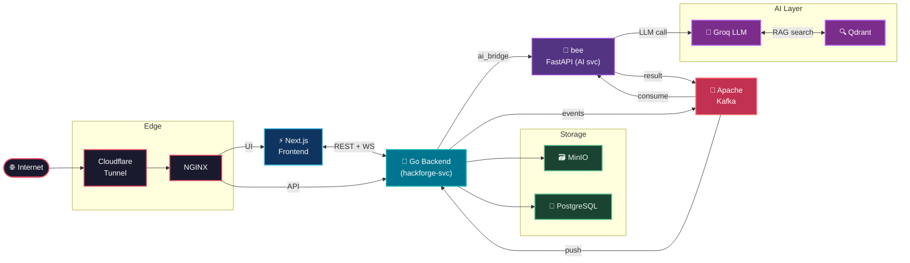

```mermaid
flowchart LR
    classDef edge     fill:#1a1a2e,stroke:#e94560,color:#fff,stroke-width:2px
    classDef fe       fill:#0f3460,stroke:#4cc9f0,color:#fff,stroke-width:2px
    classDef go       fill:#00758f,stroke:#00adb5,color:#fff,stroke-width:2px
    classDef api      fill:#533483,stroke:#9d4edd,color:#fff,stroke-width:2px
    classDef kafka    fill:#c23152,stroke:#ff6b6b,color:#fff,stroke-width:2px
    classDef ai       fill:#7b2d8b,stroke:#c77dff,color:#fff,stroke-width:2px
    classDef storage  fill:#1b4332,stroke:#52b788,color:#e8f5e9,stroke-width:2px

    USER(["🌐 Internet"]):::edge

    subgraph EDGE["  Edge  "]
        CF["Cloudflare\nTunnel"]:::edge
        NG["NGINX"]:::edge
    end

    FE["⚡ Next.js\nFrontend"]:::fe

    GO["🐹 Go Backend\n(hackforge-svc)"]:::go

    BEE["🐝 bee\nFastAPI (AI svc)"]:::api

    KF["🔴 Apache\nKafka"]:::kafka

    subgraph AI["  AI Layer  "]
        GROQ["🤖 Groq LLM"]:::ai
        QDRANT["🔍 Qdrant"]:::ai
    end

    subgraph STORE["  Storage  "]
        MINIO["🗃️ MinIO"]:::storage
        PG["🐘 PostgreSQL"]:::storage
    end

    USER --> CF --> NG
    NG -->|"UI"| FE
    NG -->|"API"| GO
    FE <-->|"REST + WS"| GO
    GO -->|"ai_bridge"| BEE
    GO -->|"events"| KF
    KF -->|"consume"| BEE
    BEE -->|"LLM call"| GROQ
    GROQ <-->|"RAG search"| QDRANT
    BEE -->|"result"| KF
    KF -->|"push"| GO
    GO --> MINIO
    GO --> PG
```
